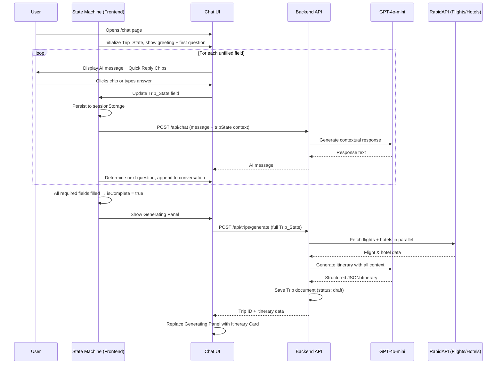
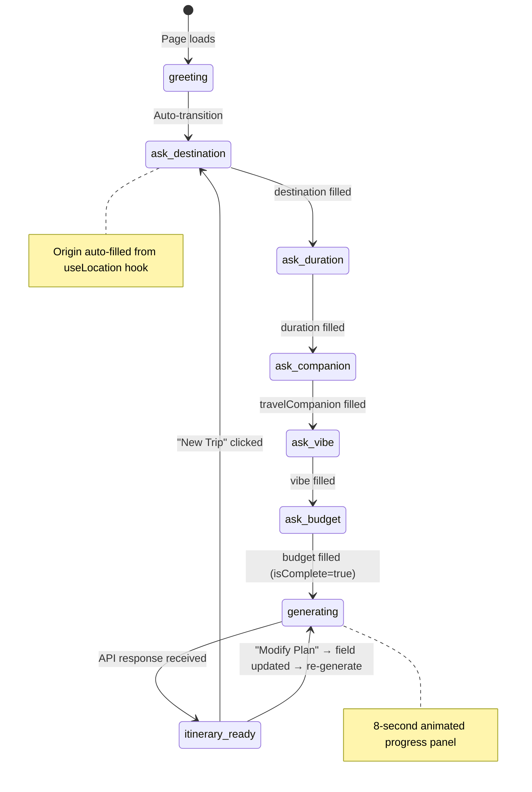
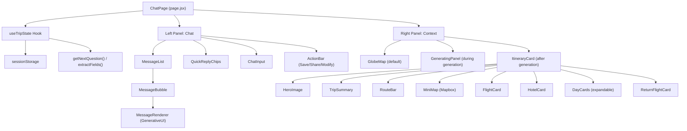

# Design Document: AI Chat Trip Generation Overhaul

## Overview

This design overhauls the AI chat trip generation flow to fix the infinite question loop bug and deliver a complete trip-planning experience. The core change replaces the current unstructured AI-driven conversation with a **deterministic client-side state machine** that controls question sequencing, while the AI handles natural language responses and itinerary generation.

The system is split into three layers:

1. **Conversation State Machine** (frontend) — tracks collected trip fields, decides the next question, and triggers generation when complete
2. **Chat UI with Quick Reply Chips** (frontend) — renders messages, interactive chips, a generating animation, and a rich itinerary card in a two-panel layout
3. **Enhanced Backend Pipeline** (backend) — accepts the full Trip_State, fetches real flight/hotel data from RapidAPI, generates a structured itinerary via GPT-4o-mini, and persists it as a Trip document

Key design decisions:

- **State machine lives on the frontend** to eliminate round-trip latency for question sequencing and avoid the AI "forgetting" what it already asked. The AI is only called for natural language generation and itinerary creation.
- **SessionStorage for Trip_State persistence** to survive page refreshes within a tab without polluting localStorage across tabs.
- **Right panel is context-sensitive** — shows a Mapbox globe during conversation, an animated generating panel during itinerary creation, and a rich itinerary card when complete.
- **Existing API structure is preserved** — the `POST /api/trips/generate` endpoint is extended (not replaced) to accept Trip_State fields. The `POST /api/chat` endpoint remains for free-form AI conversation.

## Architecture

### High-Level Flow



### State Machine Design



**Required fields (in order):** destination, duration, travelCompanion, vibe, budget

**Auto-filled fields:** origin (from useLocation hook), dates (optional, can be skipped)

**State transitions:** Each field fill advances to the next state. If the user provides multiple fields in one free-text message, the state machine skips ahead accordingly.

### Component Architecture



## Components and Interfaces

### Frontend Components

#### 1. `useTripState` Hook (new: `frontend/src/hooks/useTripState.js`)

The core state machine hook. Manages Trip_State, persistence, field extraction, and question sequencing.

```javascript
// Interface
function useTripState(userLocation) → {
  tripState: TripState,           // Current state object
  updateField: (field, value) => void,  // Set a single field
  extractFields: (text) => ExtractedFields, // Parse free-text for trip info
  getNextQuestion: () => QuestionConfig | null, // Next question to ask (null = complete)
  isComplete: boolean,            // All required fields filled
  reset: () => void,              // Clear state + sessionStorage
  chatStage: 'greeting' | 'asking' | 'generating' | 'ready',
  setChatStage: (stage) => void,
}
```

**Field extraction logic** uses regex patterns to identify:

- Destinations: capitalized place names, "to {place}" patterns
- Duration: "X days", "X weeks", "a week" patterns
- Companions: "solo", "with friends", "family", "couple" keywords
- Vibe: matches against known vibe keywords (history, food, shopping, etc.)
- Budget: "budget", "mid-range", "luxury", or dollar amounts

#### 2. `QuickReplyChips` Component (new: `frontend/src/components/chat/QuickReplyChips.jsx`)

Renders clickable option chips below AI messages based on the current question type.

```javascript
// Props
{
  questionType: 'destination' | 'duration' | 'travelCompanion' | 'vibe' | 'budget',
  onSelect: (value: string | string[]) => void,  // Callback when chip(s) selected
  multiSelect?: boolean,  // For vibe selection (multiple chips)
}
```

**Chip configurations:**
| Question Type | Options | Multi-select |
|---|---|---|
| duration | "3 days", "1 week", "2 weeks", "Custom" | No |
| travelCompanion | "Solo", "With friends", "Family", "Couple" | No |
| vibe | "History", "Food", "Shopping", "Adventure", "Nature", "Nightlife", "Culture", "Relaxation" | Yes |
| budget | "Budget", "Mid-range", "Luxury" | No |

#### 3. `GeneratingPanel` Component (refactored in `frontend/src/app/chat/page.jsx`)

Already exists but will be enhanced to show the origin-to-destination heading format and Unsplash images.

```javascript
// Props
{
  origin: string,       // From Trip_State
  destination: string,  // From Trip_State
}
```

#### 4. `ItineraryCard` Component (new: `frontend/src/components/chat/ItineraryCard.jsx`)

The rich right-panel display for the generated itinerary. This is the largest new component.

```javascript
// Props
{
  itinerary: ItineraryData,    // Full itinerary from API
  tripId: string | null,       // MongoDB _id after save
  origin: string,
  destination: string,
  onSave: () => void,
  onShare: () => void,
  onModify: () => void,
}
```

**Sub-sections rendered:**

1. Hero image (Unsplash destination photo)
2. Trip summary stats (days, cities, experiences, hotels, transport)
3. Route bar (Origin → Destination → Origin with dates)
4. Mapbox mini-map with arc
5. Destination description + photos
6. Flight card (outbound) with airline, times, price in PKR, Change/Lock buttons
7. Hotel card with image, stars, rating, price/night in PKR
8. Day-by-day expandable cards (day number, theme, activities by time-of-day)
9. Return flight card
10. Sticky bottom action bar (Save Trip, Share to Community, Modify Plan)

#### 5. `ShareTripModal` (modified: `frontend/src/components/chat/ShareTripModal.jsx`)

Existing component. Modifications:

- Add a trip preview section showing destination name and trip title
- Add a personal note text field
- Add an anonymous sharing toggle
- Wire the publish call to `POST /api/community/trips/:id/publish` with the note and anonymous flag

### Backend Interfaces

#### 1. `POST /api/trips/generate` (modified: `backend/controllers/chatController.js`)

**Current request body:**

```json
{
  "destination": "string",
  "days": 7,
  "budget": "string",
  "interests": [],
  "dietary": []
}
```

**New request body (extended):**

```json
{
  "destination": "Istanbul",
  "origin": "Karachi",
  "duration": "1 week",
  "days": 7,
  "travelCompanion": "Solo",
  "vibe": ["History", "Food"],
  "budget": "Mid-range",
  "dates": { "start": "2025-08-01", "end": "2025-08-07" },
  "interests": ["History", "Food"],
  "dietary": ["halal"]
}
```

**Response (extended):**

```json
{
  "success": true,
  "data": {
    "trip": { "_id": "...", "title": "...", "status": "draft", ... },
    "itinerary": {
      "title": "7-Day Istanbul Adventure",
      "destination": "Istanbul",
      "origin": "Karachi",
      "heroImage": "https://images.unsplash.com/...",
      "summary": { "days": 7, "cities": 1, "experiences": 21, "hotels": 1, "transport": "flight" },
      "route": { "origin": "Karachi", "destination": "Istanbul", "startDate": "...", "endDate": "..." },
      "flight": { "airline": "...", "from": "KHI", "to": "IST", "departure": "...", "arrival": "...", "price": "PKR 85,000", "duration": "5h 30m", "stops": 0 },
      "returnFlight": { ... },
      "hotel": { "name": "...", "stars": 4, "rating": 8.5, "pricePerNight": "PKR 12,000", "image": "...", "address": "..." },
      "days": [
        {
          "day": 1,
          "theme": "Old City Discovery",
          "activities": [
            { "time": "09:00", "period": "morning", "name": "...", "description": "...", "type": "attraction", "cost": { "amount": 500, "currency": "PKR" } },
            ...
          ]
        }
      ],
      "totalBudget": { "amount": 250000, "currency": "PKR" },
      "tips": ["..."]
    }
  }
}
```

#### 2. `POST /api/chat` (unchanged interface, modified context)

The frontend will now include `tripState` in the request body so the AI can generate contextually aware responses:

```json
{
  "message": "I want to explore historical sites",
  "tripState": { "destination": "Istanbul", "duration": null, ... }
}
```

#### 3. `POST /api/community/trips/:id/publish` (modified: `backend/controllers/communityController.js`)

**Extended request body:**

```json
{
  "description": "My amazing Istanbul trip!",
  "tags": ["istanbul", "history", "food"],
  "anonymous": false,
  "note": "Great for solo travelers"
}
```

### Backend Service Changes

#### `agent.js` — `generateItinerary` function modifications

- Accept `origin`, `travelCompanion`, `vibe`, and `dates` parameters in addition to existing ones
- Pass `origin` to `searchFlights` instead of hardcoded `user.preferences.homeCity`
- Include `travelCompanion` and `vibe` in the prompt context
- Return separate `flight` and `returnFlight` objects
- Include `heroImage` URL (Unsplash) in response
- Add `period` field (morning/lunch/afternoon/dinner) to each activity

#### `agent.js` — `chat` function modifications

- Accept optional `tripState` parameter from request body
- Include Trip_State summary in the system prompt context so the AI acknowledges already-collected fields

#### `prompts.js` — `itineraryPrompt` modifications

- Add Trip_State fields (origin, companion, vibe) to the prompt template
- Update JSON response format to include `origin`, `returnFlight`, `heroImage`, `summary`, `route`, and `period` per activity
- Add instruction to group activities by time-of-day period

#### `flightService.js` — Mock fallback

- Add a `getMockFlights` function that returns realistic mock data when RapidAPI fails or quota is exceeded
- Mock data includes airline names, times, and PKR prices

#### `hotelService.js` — Mock fallback

- Add a `getMockHotels` function that returns realistic mock data when RapidAPI fails
- Mock data includes hotel names, star ratings, PKR prices, and placeholder images

## Data Models

### Trip_State (Frontend — Client-Side Object)

```typescript
interface TripState {
  destination: string | null; // e.g., "Istanbul"
  origin: string | null; // e.g., "Karachi" (auto-filled from useLocation)
  duration: string | null; // e.g., "1 week", "3 days"
  travelCompanion: string | null; // "Solo" | "With friends" | "Family" | "Couple"
  vibe: string[] | null; // e.g., ["History", "Food"]
  budget: string | null; // "Budget" | "Mid-range" | "Luxury"
  dates: { start: string; end: string } | null; // Optional ISO date strings
  isComplete: boolean; // true when all required fields are filled
}
```

**Storage:** `sessionStorage` under key `tripState`

**Required fields for completion:** destination, duration, travelCompanion, vibe, budget

**Auto-filled:** origin (from `useLocation` hook on page load)

### QuestionConfig (Frontend — State Machine Output)

```typescript
interface QuestionConfig {
  field: keyof TripState; // Which field this question fills
  prompt: string; // AI-friendly prompt text to send to backend
  chipType: string; // Which QuickReplyChips config to show
  multiSelect: boolean; // Whether multiple chips can be selected
}
```

### ExtractedFields (Frontend — Field Extraction Result)

```typescript
interface ExtractedFields {
  destination?: string;
  duration?: string;
  travelCompanion?: string;
  vibe?: string[];
  budget?: string;
  dates?: { start: string; end: string };
}
```

### Trip Model (Backend — MongoDB, extended)

The existing `Trip` model in `backend/models/Trip.js` is extended with new fields:

```javascript
// New fields added to tripSchema
{
  origin: { type: String, trim: true },                    // Origin city
  travelCompanion: { type: String, trim: true },           // Solo, Family, etc.
  vibe: [String],                                          // ["History", "Food"]
  flightData: {                                            // Outbound flight snapshot
    airline: String,
    from: String,
    to: String,
    departure: String,
    arrival: String,
    price: String,
    duration: String,
    stops: Number,
    airlineLogo: String,
  },
  returnFlightData: {                                      // Return flight snapshot
    airline: String,
    from: String,
    to: String,
    departure: String,
    arrival: String,
    price: String,
    duration: String,
    stops: Number,
    airlineLogo: String,
  },
  hotelData: {                                             // Hotel snapshot
    name: String,
    stars: Number,
    rating: Number,
    pricePerNight: String,
    image: String,
    address: String,
    distance: String,
  },
  heroImage: String,                                       // Unsplash destination image URL
  communityNote: String,                                   // Personal note for community sharing
  isAnonymous: { type: Boolean, default: false },          // Anonymous sharing flag
}
```

### Activity Schema (Backend — extended)

```javascript
// New field added to activitySchema
{
  period: { type: String, enum: ['morning', 'lunch', 'afternoon', 'dinner'] },
}
```

### Chat Message with Trip Context (API Request)

```typescript
// POST /api/chat request body
interface ChatRequest {
  message: string;
  tripState?: TripState; // Optional: included when in trip-planning flow
}
```

## Correctness Properties

_A property is a characteristic or behavior that should hold true across all valid executions of a system — essentially, a formal statement about what the system should do. Properties serve as the bridge between human-readable specifications and machine-verifiable correctness guarantees._

### Property 1: Question ordering respects defined sequence and skips filled fields

_For any_ Trip_State object with an arbitrary combination of filled and unfilled required fields, `getNextQuestion()` SHALL return the first unfilled field according to the strict order: destination → duration → travelCompanion → vibe → budget. If all required fields are filled, it SHALL return null.

**Validates: Requirements 1.2, 1.4**

### Property 2: Field updates are stored in Trip_State

_For any_ valid Trip_State field name and any non-null value, calling `updateField(field, value)` SHALL result in `tripState[field]` equaling the provided value.

**Validates: Requirements 1.3, 2.5**

### Property 3: Field extraction from free text

_For any_ text string containing one or more recognizable trip-planning patterns (destination names, duration phrases like "X days"/"X weeks", companion keywords, vibe keywords, budget keywords), `extractFields(text)` SHALL return an object where each recognized field is correctly populated and no unrecognized fields are set.

**Validates: Requirements 1.5, 9.3**

### Property 4: Trip_State sessionStorage round-trip

_For any_ valid Trip_State object, serializing it to sessionStorage and then deserializing it back SHALL produce an object deeply equal to the original.

**Validates: Requirements 1.8, 1.9**

### Property 5: Completion detection

_For any_ Trip_State object where all required fields (destination, duration, travelCompanion, vibe, budget) are non-null, `isComplete` SHALL be true. _For any_ Trip_State where at least one required field is null, `isComplete` SHALL be false.

**Validates: Requirements 1.6**

### Property 6: Generating panel heading format

_For any_ non-empty origin and destination strings, the GeneratingPanel heading SHALL contain both the origin and destination values in the format "{ORIGIN} to {DESTINATION} Trip".

**Validates: Requirements 3.2**

### Property 7: Itinerary summary completeness

_For any_ valid itinerary data object, the ItineraryCard summary section SHALL display: total days count, city count, number of experiences, hotel count, and transport type.

**Validates: Requirements 4.3**

### Property 8: Route bar completeness

_For any_ valid origin, destination, and date range, the ItineraryCard route bar SHALL display the origin, destination, and travel dates.

**Validates: Requirements 4.4**

### Property 9: Flight card field completeness

_For any_ valid flight data object with non-null fields, the flight card SHALL display: airline name, departure time, arrival time, price in PKR, and action buttons.

**Validates: Requirements 4.7**

### Property 10: Hotel card field completeness

_For any_ valid hotel data object with non-null fields, the hotel card SHALL display: hotel image, star rating, guest rating, price per night in PKR, and hotel name.

**Validates: Requirements 4.8**

### Property 11: Day card structure and activity grouping

_For any_ itinerary with N days (N ≥ 1), the ItineraryCard SHALL render exactly N day cards, each showing the correct day number and theme. Activities within each day card SHALL be grouped by their time-of-day period (morning, lunch, afternoon, dinner).

**Validates: Requirements 4.9**

### Property 12: Itinerary prompt includes all Trip_State fields

_For any_ complete Trip_State object, the `itineraryPrompt()` function SHALL produce a prompt string that contains the destination, origin, duration, travelCompanion, vibe entries, and budget values.

**Validates: Requirements 5.2**

### Property 13: Flight service response mapping completeness

_For any_ valid RapidAPI Sky Scrapper response object containing flight itineraries, the `searchFlights` mapping SHALL produce result objects that each contain: airline name, origin airport code, destination airport code, departure time, arrival time, duration, number of stops, and price.

**Validates: Requirements 6.3**

### Property 14: Hotel service response mapping completeness

_For any_ valid RapidAPI Booking.com response object containing hotel results, the `searchHotels` mapping SHALL produce result objects that each contain: hotel name, star rating, guest rating, price per night, distance from city center, and hotel image URL.

**Validates: Requirements 6.4**

### Property 15: Community trip card field completeness

_For any_ shared trip data object, the Community_Page trip card SHALL display: destination image (or gradient fallback), trip title, author name, like count, and action buttons (Like, Clone, View).

**Validates: Requirements 8.7**

## Error Handling

### Frontend Error Handling

| Scenario                                   | Handling                                   | User Feedback                                                   |
| ------------------------------------------ | ------------------------------------------ | --------------------------------------------------------------- |
| API call to `/api/chat` fails              | Catch error, display fallback message      | "Sorry, something went wrong. Please try again." message bubble |
| API call to `/api/trips/generate` fails    | Catch error, reset chatStage to "asking"   | Error toast: "Failed to generate itinerary. Please try again."  |
| Save trip fails (POST /api/trips/generate) | Catch error, keep Save button enabled      | Error toast with descriptive message from API                   |
| Publish to community fails                 | Catch error in ShareTripModal              | Error toast: "Failed to publish trip" with API error message    |
| useLocation hook fails                     | Falls back to Karachi, PK defaults         | No user-visible error; origin auto-filled with fallback         |
| sessionStorage unavailable                 | Graceful degradation — state not persisted | No error shown; state works in-memory only                      |
| Mapbox fails to load                       | GlobeMap component handles internally      | Map area shows blank; does not block chat functionality         |
| Unsplash image fails to load               | Use gradient fallback (#FF4500 → #FF6B35)  | Gradient placeholder instead of broken image                    |
| Field extraction finds no matches          | Return empty object, no fields updated     | No error; user continues typing normally                        |

### Backend Error Handling

| Scenario                              | Handling                               | Response                                |
| ------------------------------------- | -------------------------------------- | --------------------------------------- |
| OpenAI API key not configured         | Throw error early in agent functions   | 500: "OpenAI API key not configured"    |
| OpenAI API call fails                 | Catch and re-throw with context        | 500: "Failed to generate itinerary"     |
| OpenAI returns invalid JSON           | Catch JSON.parse error, return error   | 500: "Failed to parse AI response"      |
| RapidAPI flight search fails          | Return empty array (existing behavior) | Itinerary generated without flight data |
| RapidAPI hotel search fails           | Return empty array (existing behavior) | Itinerary generated without hotel data  |
| RapidAPI quota exceeded               | Return mock fallback data              | Itinerary uses mock flight/hotel data   |
| Trip save to MongoDB fails            | Catch and pass to error handler        | 500: "Failed to save trip"              |
| Invalid Trip_State in request         | Validate required fields, return 400   | 400: "destination is required"          |
| User not authenticated for save/share | Auth middleware rejects                | 401: "Not authenticated"                |
| Trip not found for publish            | Return 404                             | 404: "Trip not found"                   |

### Retry and Fallback Strategy

1. **RapidAPI services**: No retry — single attempt with 15s timeout. On failure, use mock data fallback.
2. **OpenAI API**: No automatic retry. Frontend can retry by re-triggering generation.
3. **Location detection**: Three-tier fallback (backend detect → freeipapi → ipwhois → hardcoded Karachi).
4. **Weather/Currency**: Already handled by existing agent pipeline — null values are acceptable.

## Testing Strategy

### Testing Approach

This feature uses a **dual testing approach**:

- **Property-based tests** verify universal correctness properties across many generated inputs (state machine logic, field extraction, data mapping, rendering completeness)
- **Unit tests** verify specific examples, edge cases, and error conditions
- **Integration tests** verify API endpoints, database persistence, and cross-component wiring

### Property-Based Testing

**Library:** [fast-check](https://github.com/dubzzz/fast-check) for JavaScript/TypeScript property-based testing.

**Configuration:**

- Minimum 100 iterations per property test
- Each test tagged with: `Feature: ai-chat-trip-generation, Property {N}: {title}`

**Properties to implement:**

| Property                      | Layer                      | What it tests                                                    |
| ----------------------------- | -------------------------- | ---------------------------------------------------------------- |
| P1: Question ordering         | Frontend (useTripState)    | getNextQuestion returns correct next field for any Trip_State    |
| P2: Field update persistence  | Frontend (useTripState)    | updateField stores value correctly for any field/value           |
| P3: Field extraction          | Frontend (useTripState)    | extractFields parses trip info from any text with known patterns |
| P4: SessionStorage round-trip | Frontend (useTripState)    | Serialize → deserialize Trip_State preserves all data            |
| P5: Completion detection      | Frontend (useTripState)    | isComplete is true iff all required fields are non-null          |
| P6: Generating panel heading  | Frontend (GeneratingPanel) | Heading contains origin and destination for any strings          |
| P7: Summary completeness      | Frontend (ItineraryCard)   | Summary shows all required stats for any itinerary               |
| P8: Route bar completeness    | Frontend (ItineraryCard)   | Route bar shows origin, destination, dates for any values        |
| P9: Flight card fields        | Frontend (ItineraryCard)   | Flight card shows all required fields for any flight data        |
| P10: Hotel card fields        | Frontend (ItineraryCard)   | Hotel card shows all required fields for any hotel data          |
| P11: Day card structure       | Frontend (ItineraryCard)   | N days → N cards, activities grouped by period                   |
| P12: Prompt completeness      | Backend (prompts.js)       | Prompt contains all Trip_State values for any input              |
| P13: Flight mapping           | Backend (flightService.js) | Mapped results have all required fields for any API response     |
| P14: Hotel mapping            | Backend (hotelService.js)  | Mapped results have all required fields for any API response     |
| P15: Community card fields    | Frontend (CommunityPage)   | Trip card shows all required fields for any trip data            |

### Unit Tests (Example-Based)

| Test                                  | What it verifies                                            |
| ------------------------------------- | ----------------------------------------------------------- |
| Trip_State initialization             | All fields null, isComplete false (Req 1.1)                 |
| Origin auto-fill from useLocation     | Origin populated from hook (Req 1.7)                        |
| Reset clears state and sessionStorage | New Trip button resets everything (Req 1.10)                |
| Duration chip options                 | Correct chips for duration question (Req 2.1)               |
| Companion chip options                | Correct chips for companion question (Req 2.2)              |
| Vibe chip options (multi-select)      | Correct chips with multi-select enabled (Req 2.3)           |
| Budget chip options                   | Correct chips for budget question (Req 2.4)                 |
| Chip click adds user message          | Selected value appears as user message (Req 2.6)            |
| Generating panel gradient             | Correct CSS gradient values (Req 3.1)                       |
| Checklist items content               | Four specific checklist items (Req 3.4)                     |
| Progress animation timing             | Checklist checks at 25/50/75/100% (Req 3.5, 3.6, 3.7)       |
| Itinerary replaces generating panel   | Stage transition renders correct component (Req 4.1)        |
| Day card expand/collapse              | Click toggles activity visibility (Req 4.10)                |
| Return flight card rendered           | Return flight appears after day cards (Req 4.11)            |
| Action buttons present                | Save, Share, Modify buttons rendered (Req 4.12)             |
| Save trip success toast               | Toast shown on successful save (Req 7.2)                    |
| Save button state change              | Button shows "Saved" with checkmark after save (Req 7.3)    |
| Share modal opens                     | Share button opens ShareTripModal (Req 8.1)                 |
| Share modal preview                   | Modal shows destination and title (Req 8.2)                 |
| Share modal note field                | Personal note input rendered (Req 8.3)                      |
| Share modal anonymous toggle          | Anonymous toggle rendered (Req 8.4)                         |
| Community page filters                | Search and sort controls rendered (Req 8.8)                 |
| Modify plan re-triggers generation    | Modify flow allows field update and re-generation (Req 9.4) |

### Edge Case Tests

| Test                               | What it verifies                                              |
| ---------------------------------- | ------------------------------------------------------------- |
| Flight API failure → mock fallback | Mock data returned when RapidAPI fails (Req 6.5)              |
| Hotel API failure → mock fallback  | Mock data returned when RapidAPI fails (Req 6.6)              |
| Save failure → error toast         | Error toast with message on save failure (Req 7.6)            |
| Empty text extraction              | extractFields returns empty object for empty/whitespace input |
| Ambiguous text extraction          | extractFields handles text with no recognizable patterns      |
| SessionStorage quota exceeded      | State works in-memory when storage is full                    |

### Integration Tests

| Test                                     | What it verifies                                                             |
| ---------------------------------------- | ---------------------------------------------------------------------------- |
| POST /api/trips/generate with Trip_State | Endpoint accepts extended body, returns trip + itinerary (Req 5.1, 5.5, 5.6) |
| POST /api/chat with tripState context    | Endpoint accepts tripState in body (Req 9.1)                                 |
| POST /api/community/trips/:id/publish    | Endpoint makes trip public with note and anonymous flag (Req 8.5)            |
| Dashboard reflects saved trip            | Trip count and recent trips update after save (Req 7.4, 7.5)                 |
| Community page shows published trip      | Published trip appears in grid (Req 8.6)                                     |
| Flight service → RapidAPI integration    | Correct API called with origin/destination (Req 6.1)                         |
| Hotel service → RapidAPI integration     | Correct API called with destination (Req 6.2)                                |
| PKR price conversion                     | Flight and hotel prices in PKR (Req 6.7, 6.8)                                |
