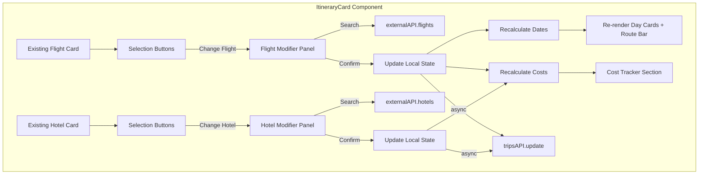

# Design Document: Flight & Hotel Modifier

## Overview

This feature adds an interactive selection and modification layer to the existing `ItineraryCard` component. Users can confirm the current flight/hotel or open inline modifier panels to search for alternatives via the existing RapidAPI-backed endpoints. When selections change, downstream dates auto-recalculate and a cost tracker summarizes the trip budget.

All changes are scoped to `frontend/src/components/chat/ItineraryCard.jsx`. No backend changes are required — the existing `GET /api/external/flights`, `GET /api/external/hotels`, and `PUT /api/trips/:id` endpoints are sufficient.

### Key Design Decisions

1. **Single-file approach**: All new UI (buttons, modifier panels, cost tracker) lives inside `ItineraryCard.jsx` as inline sub-sections rather than extracted components. This matches the existing pattern where the entire card (1200+ lines) is a single component with inline styles. Extracting sub-components would be a separate refactor.

2. **Local state over global store**: All modifier state (panel open/closed, selected alternatives, loading, filters) is managed via `useState` hooks within the component. The itinerary data is already passed as a prop and mutated locally before being persisted via `tripsAPI.update`. No Zustand store changes needed.

3. **Fire-and-forget persistence**: When a user confirms a new flight or hotel, the component updates local state immediately and fires `tripsAPI.update` asynchronously. Errors are logged but don't revert the UI — the user sees their change instantly.

4. **Pure computation for date recalculation and cost aggregation**: Date shifting and cost summing are pure functions of the itinerary data, making them testable independently of React rendering.

## Architecture



### Data Flow

1. User clicks "Change Flight" → Flight Modifier panel expands below the flight card
2. User sets filters (date, time preference, stops) and clicks "Search New Flights"
3. Component calls `externalAPI.flights(origin, destination, date, options)` → loading state shown
4. Results render as selectable Alternative Cards (radio-select pattern)
5. User picks one and clicks "Confirm New Flight"
6. Component replaces `itinerary.flight` (or `itinerary.returnFlight`) in local state
7. `recalculateDates()` shifts all day-card dates if the departure date changed
8. `calculateCosts()` recomputes the cost tracker
9. `tripsAPI.update(tripId, updatedItinerary)` fires asynchronously
10. Same flow for hotel, minus the date recalculation step

## Components and Interfaces

### New State Variables

```javascript
// Flight selection
const [flightSelected, setFlightSelected] = useState(false);
const [returnFlightSelected, setReturnFlightSelected] = useState(false);

// Flight modifier
const [flightModifierOpen, setFlightModifierOpen] = useState(false); // outbound
const [returnFlightModifierOpen, setReturnFlightModifierOpen] = useState(false);
const [flightSearchDate, setFlightSearchDate] = useState("");
const [flightTimePreference, setFlightTimePreference] = useState("any"); // 'morning' | 'afternoon' | 'evening' | 'any'
const [flightStopsFilter, setFlightStopsFilter] = useState("any"); // 'direct' | '1stop' | 'any'
const [flightResults, setFlightResults] = useState([]);
const [flightLoading, setFlightLoading] = useState(false);
const [flightError, setFlightError] = useState(null);
const [selectedFlightId, setSelectedFlightId] = useState(null);

// Return flight modifier (mirrors outbound)
const [returnFlightSearchDate, setReturnFlightSearchDate] = useState("");
const [returnFlightTimePreference, setReturnFlightTimePreference] =
  useState("any");
const [returnFlightStopsFilter, setReturnFlightStopsFilter] = useState("any");
const [returnFlightResults, setReturnFlightResults] = useState([]);
const [returnFlightLoading, setReturnFlightLoading] = useState(false);
const [returnFlightError, setReturnFlightError] = useState(null);
const [selectedReturnFlightId, setSelectedReturnFlightId] = useState(null);

// Hotel selection
const [hotelSelected, setHotelSelected] = useState(false);

// Hotel modifier
const [hotelModifierOpen, setHotelModifierOpen] = useState(false);
const [hotelBudget, setHotelBudget] = useState("any"); // 'budget' | 'mid' | 'luxury' | 'any'
const [hotelStars, setHotelStars] = useState("any"); // 'any' | '3' | '4' | '5'
const [hotelLocation, setHotelLocation] = useState("any"); // 'center' | 'airport' | 'attractions' | 'any'
const [hotelResults, setHotelResults] = useState([]);
const [hotelLoading, setHotelLoading] = useState(false);
const [hotelError, setHotelError] = useState(null);
const [selectedHotelId, setSelectedHotelId] = useState(null);

// Local mutable itinerary (cloned from prop on first modifier action)
const [localItinerary, setLocalItinerary] = useState(null);
```

### Pure Utility Functions

#### `parsePriceRaw(priceString)`

Extracts a numeric value from a formatted price string like `"PKR 85,000"` or `"$120"`.

```javascript
/**
 * Parse a price string into a raw number.
 * Returns null if unparseable.
 * @param {string|number} price
 * @returns {number|null}
 */
function parsePriceRaw(price) {
  if (typeof price === "number") return price;
  if (typeof price !== "string") return null;
  const cleaned = price.replace(/[^0-9.]/g, "");
  const num = parseFloat(cleaned);
  return isNaN(num) ? null : num;
}
```

#### `recalculateDates(itinerary, newDepartureDate)`

Shifts all day-card dates so Day 1 starts on the day after the new departure, preserving the day count and all activity content.

```javascript
/**
 * Recalculate itinerary dates based on a new outbound departure date.
 * Returns a new itinerary object (does not mutate input).
 *
 * @param {Object} itinerary - The full itinerary object
 * @param {string} newDepartureDate - ISO date string of the new departure
 * @returns {Object} Updated itinerary with shifted dates
 */
function recalculateDates(itinerary, newDepartureDate) {
  const depDate = new Date(newDepartureDate);
  const arrivalDate = new Date(depDate);
  arrivalDate.setDate(arrivalDate.getDate()); // arrival = same day for simplicity

  const totalDays = itinerary.days?.length || 0;
  const newDays = (itinerary.days || []).map((day, index) => {
    const dayDate = new Date(arrivalDate);
    dayDate.setDate(dayDate.getDate() + index);
    return { ...day, date: dayDate.toISOString().split("T")[0] };
  });

  const newEndDate = new Date(arrivalDate);
  newEndDate.setDate(newEndDate.getDate() + totalDays - 1);

  return {
    ...itinerary,
    days: newDays,
    route: {
      ...itinerary.route,
      startDate: depDate.toISOString().split("T")[0],
      endDate: itinerary.returnFlight
        ? itinerary.route?.endDate
        : newEndDate.toISOString().split("T")[0],
    },
  };
}
```

#### `calculateCosts(itinerary)`

Computes a cost breakdown from the current itinerary state.

```javascript
/**
 * Calculate cost breakdown from itinerary data.
 * Returns an object with individual line items and a total.
 *
 * @param {Object} itinerary
 * @returns {{ outboundFlight: number|null, returnFlight: number|null, hotelTotal: number|null, food: number|null, activities: number|null, total: number }}
 */
function calculateCosts(itinerary) {
  const outboundFlight = parsePriceRaw(
    itinerary.flight?.priceRaw ?? itinerary.flight?.price,
  );
  const returnFlight = parsePriceRaw(
    itinerary.returnFlight?.priceRaw ?? itinerary.returnFlight?.price,
  );

  const hotelPricePerNight = parsePriceRaw(
    itinerary.hotel?.priceRaw ??
      itinerary.hotel?.pricePerNight ??
      itinerary.hotel?.price,
  );
  const numNights = itinerary.days?.length || 0;
  const hotelTotal =
    hotelPricePerNight != null ? hotelPricePerNight * numNights : null;

  // Estimate food and activities from day activities
  let foodTotal = 0;
  let activitiesTotal = 0;
  (itinerary.days || []).forEach((day) => {
    (day.activities || []).forEach((activity) => {
      const cost = activity.cost?.amount;
      if (cost != null) {
        if (activity.period === "lunch" || activity.period === "dinner") {
          foodTotal += cost;
        } else {
          activitiesTotal += cost;
        }
      }
    });
  });

  const items = [
    outboundFlight,
    returnFlight,
    hotelTotal,
    foodTotal || null,
    activitiesTotal || null,
  ];
  const total = items.reduce((sum, val) => sum + (val ?? 0), 0);

  return {
    outboundFlight,
    returnFlight,
    hotelTotal,
    food: foodTotal || null,
    activities: activitiesTotal || null,
    total,
  };
}
```

### UI Sections (Rendering Order)

The new UI elements are inserted into the existing render flow:

1. **Outbound Flight Card** (existing) → **Selection Buttons** → **Flight Modifier Panel** (conditional)
2. **Transfer Card** (existing, optional)
3. **Hotel Card** (existing) → **Selection Buttons** → **Hotel Modifier Panel** (conditional)
4. **Day Cards** (existing)
5. **Return Flight Card** (existing) → **Selection Buttons** → **Return Flight Modifier Panel** (conditional)
6. **Cost Tracker** (new, always visible)
7. **Sticky Action Bar** (existing)

### Selection Buttons Layout

Each flight/hotel card gets two buttons below the existing content:

- **"✓ Select This [Flight|Hotel]"**: Orange filled (`background: linear-gradient(135deg, #FF4500, #FF6B35)`), white text. On click, marks the card as selected (orange border, buttons disabled).
- **"✏️ Change [Flight|Hotel]"**: White background, gray border (`1.5px solid #E5E7EB`). On click, opens the modifier panel.

When selected, the card gets `border: 2px solid #FF4500` and both buttons become disabled with reduced opacity.

### Modifier Panel Layout

Both flight and hotel modifier panels share a common structure:

```
┌─────────────────────────────────────────┐
│  Filter Chips Row(s)                    │
│  [chip] [chip] [chip] [chip]            │
│                                         │
│  [  Search Button  ]                    │
│                                         │
│  ── Loading / Error / Results ──        │
│                                         │
│  ○ Alternative Card 1                   │
│  ● Alternative Card 2  (selected)       │
│  ○ Alternative Card 3                   │
│                                         │
│  [  Confirm Selection  ]                │
└─────────────────────────────────────────┘
```

**Flight Modifier** filter rows:

- Date picker: `<input type="date" />`
- Time preference chips: Morning (6-12), Afternoon (12-6), Evening (6-10), Any time
- Stops filter chips: Direct only, 1 stop ok, Any

**Hotel Modifier** filter rows:

- Budget chips: Budget, Mid-range, Luxury
- Star rating chips: Any, 3★, 4★, 5★
- Location chips: City Center, Near Airport, Near Attractions, Any

### Alternative Card Layout

**Flight Alternative Card:**

```
┌──────────────────────────────────────┐
│  ○  Turkish Airlines                 │
│     KHI → IST  ·  08:30 → 14:00     │
│     5h 30m  ·  Direct                │
│     PKR 85,000                       │
└──────────────────────────────────────┘
```

**Hotel Alternative Card:**

```
┌──────────────────────────────────────┐
│  [img]  ○  Grand Istanbul Hotel      │
│         ⭐⭐⭐⭐⭐  9.1/10            │
│         📍 Central District           │
│         PKR 18,500 / night            │
└──────────────────────────────────────┘
```

### Cost Tracker Layout

```
┌─────────────────────────────────────────┐
│  💰 Estimated Trip Cost                 │
│  ─────────────────────────────────────  │
│  ✈️ Outbound Flight      PKR 85,000    │
│  ✈️ Return Flight         PKR 85,000    │
│  🏨 Hotel (5 nights)      PKR 92,500    │
│  🍽️ Food                  PKR 15,000    │
│  🎯 Activities             PKR 22,000    │
│  ─────────────────────────────────────  │
│  Total                    PKR 299,500   │
└─────────────────────────────────────────┘
```

## Data Models

### Itinerary Object (existing, no changes)

The component receives the full itinerary as a prop. The relevant fields:

```typescript
interface Itinerary {
  title: string;
  heroImage?: string;
  flight?: FlightData;
  returnFlight?: FlightData;
  hotel?: HotelData;
  days?: DayData[];
  route?: {
    startDate: string;
    endDate: string;
    origin?: string;
    destination?: string;
  };
  summary?: {
    days: number;
    cities: number;
    experiences: number;
    hotels: number;
    transport: string;
  };
  totalBudget?: string;
  transfer?: { price: string; duration: string };
}
```

### FlightData (from API response)

```typescript
interface FlightData {
  id: string;
  price: string; // formatted, e.g. "PKR 85,000"
  priceRaw: number; // numeric, e.g. 85000
  airline: string;
  airlineLogo: string;
  departure: string; // ISO datetime
  arrival: string; // ISO datetime
  duration: string; // e.g. "5h 30m"
  stops: number;
  origin: string;
  originCode: string;
  destination: string;
  destinationCode: string;
}
```

### HotelData (from API response)

```typescript
interface HotelData {
  id: string;
  name: string;
  stars: number;
  rating: number;
  ratingText: string;
  reviewCount: number;
  price: string; // formatted
  priceRaw: number; // numeric
  currency: string;
  image: string;
  address: string;
  city: string;
  distance: string;
  url: string;
}
```

### CostBreakdown (computed)

```typescript
interface CostBreakdown {
  outboundFlight: number | null;
  returnFlight: number | null;
  hotelTotal: number | null; // pricePerNight × numNights
  food: number | null;
  activities: number | null;
  total: number; // sum of non-null items
}
```

## Correctness Properties

_A property is a characteristic or behavior that should hold true across all valid executions of a system — essentially, a formal statement about what the system should do. Properties serve as the bridge between human-readable specifications and machine-verifiable correctness guarantees._

The testable properties for this feature focus on the three pure utility functions: `recalculateDates`, `calculateCosts`, and `parsePriceRaw`. These functions have clear input/output behavior, large input spaces (arbitrary dates, prices, itinerary shapes), and universal properties that hold across all valid inputs — making them ideal for property-based testing.

UI interaction behaviors (button clicks, panel visibility, radio selection) are better covered by example-based tests with React Testing Library since they test specific DOM interactions rather than universal input/output relationships.

### Property 1: Date recalculation produces sequential dates starting from departure

_For any_ itinerary with N days (N ≥ 1) and _for any_ valid departure date, calling `recalculateDates(itinerary, departureDate)` SHALL produce an itinerary where:

- Day 1's date equals the departure date
- Each subsequent day's date is exactly 1 day after the previous day's date
- The total number of days is unchanged (equals N)
- `route.startDate` equals the departure date

**Validates: Requirements 5.1, 5.2**

### Property 2: Date recalculation preserves all activity content

_For any_ itinerary with days containing activities, and _for any_ valid departure date, calling `recalculateDates(itinerary, departureDate)` SHALL produce an itinerary where every day's activities array is identical to the original — same names, descriptions, times, costs, tags, and periods.

**Validates: Requirements 5.4**

### Property 3: Return flight date updates route end date

_For any_ itinerary and _for any_ new return flight departure date, updating the return flight and recalculating SHALL set `route.endDate` to the new return date while leaving `route.startDate` unchanged.

**Validates: Requirements 5.3**

### Property 4: Cost calculation total equals sum of non-null line items

_For any_ itinerary containing flight, return flight, hotel, and day activity data with arbitrary price values, `calculateCosts(itinerary)` SHALL produce a `total` that equals the sum of all non-null individual cost items (`outboundFlight + returnFlight + hotelTotal + food + activities`), where `hotelTotal` equals the hotel's price-per-night multiplied by the number of nights.

**Validates: Requirements 6.2, 7.2**

### Property 5: Price parsing round-trip for numeric values and null for garbage

_For any_ non-negative number, `parsePriceRaw(number)` SHALL return that number. _For any_ string containing at least one digit, `parsePriceRaw(string)` SHALL return a non-negative number. _For any_ string containing no digits (or empty string, or non-string/non-number type), `parsePriceRaw` SHALL return `null`.

**Validates: Requirements 7.4**

## Error Handling

### API Errors (Flight/Hotel Search)

- **Network failures or server errors** from `externalAPI.flights()` or `externalAPI.hotels()`: Caught in a try/catch around the API call. The modifier panel displays an inline error message (e.g., "Could not load flights. Please try again.") styled with a red-tinted background. The loading state is cleared. The rest of the itinerary card remains unaffected.
- **Empty results**: If the API returns an empty array, display "No results found. Try adjusting your filters." within the modifier panel.

### Trip Update Errors

- **`tripsAPI.update()` failure**: The update is fire-and-forget. On error, `console.error` logs the failure. The local state retains the user's changes — no revert. The user is not shown an error toast since the data is preserved locally and will be retried on next save.

### Price Parsing Errors

- **Unparseable price strings**: `parsePriceRaw` returns `null`. The cost tracker displays "—" for that line item and excludes it from the total sum. This handles cases where the API returns unexpected formats like `"Contact for price"` or missing fields.

### Date Parsing Errors

- **Invalid departure dates**: `recalculateDates` receives dates from the date picker input (`<input type="date">`), which enforces valid date format. If an invalid date somehow reaches the function, the `new Date()` constructor produces `Invalid Date`, and the day dates will show as invalid. The UI should validate the date input before calling recalculate.

### State Consistency

- **Multiple rapid clicks**: Selection buttons are disabled after the first click (via the `flightSelected`/`hotelSelected` state). Modifier panels close on confirm, preventing double-submission.
- **Stale search results**: Each new search clears previous results before setting loading state, preventing display of stale data.

## Testing Strategy

### Testing Framework

- **Test runner**: Vitest (already configured in `frontend/vitest.config.js`)
- **DOM environment**: jsdom (already configured)
- **Component testing**: `@testing-library/react` + `@testing-library/jest-dom` (already installed)
- **Property-based testing**: `fast-check` v4 (already installed)

### Unit Tests (Example-Based)

Focus on specific UI interactions and rendering:

1. **Selection buttons render** — Flight and hotel cards show "Select" and "Change" buttons (Req 1.1, 3.1)
2. **Select marks card** — Clicking "Select This Flight" applies orange border and disables buttons (Req 1.2, 3.2)
3. **Change opens modifier** — Clicking "Change Flight" expands the modifier panel (Req 1.3, 3.3)
4. **Modifier panel controls** — Flight modifier shows date picker, time chips, stops filter; hotel modifier shows budget, stars, location chips (Req 2.1, 4.1)
5. **Loading state** — Search button triggers loading indicator (Req 2.3, 4.3)
6. **Results render** — API results display as selectable alternative cards (Req 2.4, 4.4)
7. **Radio selection** — Clicking an alternative highlights it and deselects others (Req 2.5, 4.5)
8. **Confirm replaces data** — Confirming a selection updates the card and collapses the panel (Req 2.6, 4.6)
9. **Error display** — API errors show inline error message (Req 2.7, 4.7)
10. **Cost tracker renders** — All line items and total displayed (Req 7.1)
11. **Cost tracker reacts** — Changing flight/hotel updates cost tracker (Req 7.3)
12. **Async persistence** — `tripsAPI.update` called on confirm when tripId exists (Req 8.1)
13. **Persistence error handling** — API error doesn't revert local state (Req 8.2)
14. **Non-blocking update** — UI updates before API resolves (Req 8.3)

### Property-Based Tests

Each property test uses `fast-check` with a minimum of 100 iterations and references its design document property.

| Property                                    | Function Under Test      | Generator Strategy                                                            |
| ------------------------------------------- | ------------------------ | ----------------------------------------------------------------------------- |
| Property 1: Sequential dates from departure | `recalculateDates`       | Random itinerary with 1-30 days, random ISO date strings                      |
| Property 2: Activity content preservation   | `recalculateDates`       | Random itinerary with days containing 0-10 activities each with random fields |
| Property 3: Return flight updates end date  | Return flight date logic | Random itinerary + random return date                                         |
| Property 4: Cost total = sum of parts       | `calculateCosts`         | Random itinerary with random prices (numbers, formatted strings, nulls)       |
| Property 5: Price parsing correctness       | `parsePriceRaw`          | Random numbers, random digit-containing strings, random non-digit strings     |

**Property test configuration:**

- Minimum iterations: 100
- Tag format: `Feature: flight-hotel-modifier, Property {N}: {title}`
- Each property test is a single `fc.assert(fc.property(...))` call

### Test File Structure

```
frontend/src/components/chat/__tests__/
  ItineraryCard.test.jsx          # Example-based UI tests
  itinerary-utils.property.test.js # Property-based tests for pure functions
```

The pure utility functions (`parsePriceRaw`, `recalculateDates`, `calculateCosts`) should be extracted to a testable module or exported from the component file for direct testing. The property tests import and test these functions directly without rendering React components.
