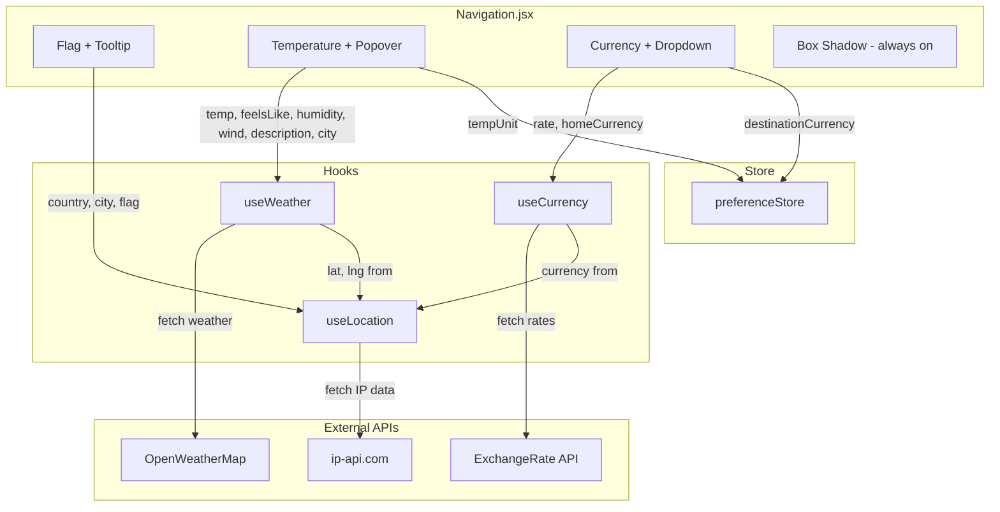

# Design Document: Navbar Enhancements

## Overview

This design covers enhancements to the existing `Navigation.jsx` component and its supporting hooks (`useLocation`, `useWeather`, `useCurrency`) and store (`preferenceStore`). The changes transform the navbar's contextual data display from a browser-geolocation-first approach to a VPN-aware IP-first model, add interactive popovers for flag/weather/currency details, apply an always-on box shadow, and ensure consistent loading states.

The scope is intentionally narrow: only the navbar area and its data hooks are modified. No changes to routing, page layouts, authentication flows, or other components.

### Key Design Decisions

1. **IP-first location detection**: The current `useLocation` hook tries browser geolocation first, then falls back to IP. The requirements mandate IP-only via `ip-api.com`, removing the browser geolocation permission prompt entirely. This ensures VPN users see data matching their exit node.

2. **Currency direction reversal**: The current `useCurrency(from, to)` is called as `useCurrency("USD", currency)` — converting USD to the user's currency. The requirements specify the opposite: Home_Currency → Destination_Currency (e.g., "PKR 1 = USD 0.0036"). The hook's `from` parameter will now be the IP-detected currency, and `to` defaults to "USD".

3. **Enhanced hook return values**: `useWeather` currently returns `{ temp, description, icon }`. The requirements need `feelsLike`, `humidity`, `windSpeed`, and `city` for the Temperature_Popover. `useLocation` needs to also return `currency` from the IP API response.

4. **Popover/tooltip pattern**: Flag uses hover (mouseenter/mouseleave), temperature and currency use click-to-toggle with outside-click-to-close. This matches the existing dropdown pattern already in `Navigation.jsx`.

## Architecture

The architecture remains a client-side React component tree with custom hooks for data fetching. No new backend endpoints are needed — the hooks call external APIs directly from the browser (ip-api.com, OpenWeatherMap) or via the existing backend proxy (currency).



### Data Flow

1. **Mount**: `useLocation` fetches from `ip-api.com` → returns `{ lat, lng, city, country, countryCode, currency, flag }`
2. **Cascade**: `useWeather(lat, lng, tempUnit)` fires when lat/lng become available → returns weather details
3. **Cascade**: `useCurrency(homeCurrency, destinationCurrency)` fires when homeCurrency is available → returns exchange rate
4. **Render**: `Navigation.jsx` renders flag, temperature, and currency displays with their respective interactive elements

## Components and Interfaces

### useLocation Hook

**File**: `frontend/src/hooks/useLocation.js`

**Changes**: Remove browser geolocation entirely. Fetch only from `ip-api.com`. Add `currency` field to response. Include `currency` in the ip-api fields parameter.

```typescript
// Return type
interface LocationState {
  lat: number | null;
  lng: number | null;
  city: string | null;
  country: string | null;
  countryCode: string | null;
  currency: string | null; // NEW: e.g., "PKR"
  flag: string; // emoji flag or "🌍"
  loading: boolean;
  error: string | null;
}
```

**API call**: `GET https://ip-api.com/json/?fields=lat,lon,city,country,countryCode,currency`

### useWeather Hook

**File**: `frontend/src/hooks/useWeather.js`

**Changes**: Expand returned state to include `feelsLike`, `humidity`, `windSpeed`, `condition`, and `city` from the OpenWeatherMap response.

```typescript
// Return type
interface WeatherState {
  temp: number | null;
  feelsLike: number | null; // NEW
  humidity: number | null; // NEW: percentage
  windSpeed: number | null; // NEW: m/s or mph
  condition: string | null; // NEW: e.g., "scattered clouds"
  city: string | null; // NEW: from OWM response
  icon: string | null; // emoji
  loading: boolean;
  error: string | null;
}
```

**API call**: Same endpoint, just extract additional fields from `data.main` and `data.wind`.

### useCurrency Hook

**File**: `frontend/src/hooks/useCurrency.js`

**Changes**: The hook signature stays `useCurrency(from, to)` but the caller changes: `Navigation.jsx` will call `useCurrency(homeCurrency, destinationCurrency)` where `homeCurrency` comes from `useLocation().currency` and `destinationCurrency` comes from `preferenceStore` (default "USD").

No structural changes to the hook itself — only the calling convention in `Navigation.jsx` changes.

### preferenceStore

**File**: `frontend/src/store/preferenceStore.js`

**Changes**: Rename `currency` to `destinationCurrency` for clarity. Default remains `"USD"`. Add `setDestinationCurrency` action. Remove the `country` field (no longer needed — flag comes from `useLocation`).

```typescript
interface PreferenceState {
  destinationCurrency: string; // renamed from "currency"
  tempUnit: "C" | "F";
  setDestinationCurrency: (code: string) => void;
  setTempUnit: (unit: string) => void;
}
```

### Navigation.jsx Component Changes

**File**: `frontend/src/components/layout/Navigation.jsx`

#### Box Shadow

- Remove the scroll-dependent `boxShadow` ternary
- Set `boxShadow: "0 2px 12px rgba(0,0,0,0.08)"` as a constant style

#### Flag Section

- Add `onMouseEnter`/`onMouseLeave` handlers to toggle a `flagTooltip` state
- Render a tooltip div below the flag showing `📍 {city}` and `🌍 {country}`

#### Temperature Section

- Add `onClick` handler to toggle a `tempPopover` state
- Render a popover div showing: 🌡️ Feels like, 💧 Humidity, 🌬️ Wind speed, ☁️ Condition, 📍 City
- Close on outside click (extend existing `useEffect` handler)

#### Currency Section

- Change display format from `1$={rate}` to `{homeCurrency} 1 = {destinationCurrency} {rate}`
- Update the dropdown to include a text input for changing the destination currency code
- Show live conversion result in the dropdown
- Close on outside click (existing behavior)

#### Loading States

- Flag: show `🌐` while `locLoading` is true (change from current `🌍`)
- Temperature: show `"—"` while `weatherLoading` is true
- Currency: show `"—"` while `rateLoading` is true

## Data Models

### IP-API Response (ip-api.com)

```json
{
  "lat": 24.8607,
  "lon": 67.0011,
  "city": "Karachi",
  "country": "Pakistan",
  "countryCode": "PK",
  "currency": "PKR"
}
```

Fields requested via `?fields=lat,lon,city,country,countryCode,currency`. No API key required. Rate limit: 45 requests/minute for free tier (non-commercial).

### OpenWeatherMap Response (relevant fields)

```json
{
  "main": {
    "temp": 28.5,
    "feels_like": 31.2,
    "humidity": 65
  },
  "wind": {
    "speed": 3.6
  },
  "weather": [
    {
      "description": "scattered clouds",
      "icon": "03d"
    }
  ],
  "name": "Karachi"
}
```

### ExchangeRate API Response (relevant fields)

```json
{
  "base": "PKR",
  "rates": {
    "USD": 0.0036,
    "EUR": 0.0033,
    "GBP": 0.0028
  }
}
```

### Preference Store (Zustand persisted)

```json
{
  "destinationCurrency": "USD",
  "tempUnit": "C"
}
```

Persisted to `localStorage` under key `"preference-storage"`.

## Correctness Properties

_A property is a characteristic or behavior that should hold true across all valid executions of a system — essentially, a formal statement about what the system should do. Properties serve as the bridge between human-readable specifications and machine-verifiable correctness guarantees._

### Property 1: IP-API response field extraction preserves all fields

_For any_ valid IP-API JSON response containing `lat`, `lon`, `city`, `country`, `countryCode`, and `currency` fields, the `useLocation` hook SHALL return an object where each field matches the corresponding value from the response exactly, with `lon` mapped to `lng`.

**Validates: Requirements 2.2, 2.5, 6.1, 6.4**

### Property 2: Country code to flag emoji conversion

_For any_ valid 2-letter ISO 3166-1 alpha-2 country code, the `countryCodeToFlag` function SHALL return a string consisting of exactly two regional indicator Unicode code points corresponding to the two letters of the code. For invalid or missing codes, it SHALL return "🌍".

**Validates: Requirements 3.1**

### Property 3: Flag tooltip content formatting

_For any_ non-null city name and country name strings, the Flag_Tooltip content SHALL contain the city prefixed with "📍" and the country prefixed with "🌍".

**Validates: Requirements 3.4**

### Property 4: Temperature display formatting

_For any_ numeric temperature value and unit string ("C" or "F"), the inline temperature display SHALL render as `"{temp}°{unit}"` where `{temp}` is the rounded integer value.

**Validates: Requirements 4.1**

### Property 5: Weather response field extraction preserves all fields

_For any_ valid OpenWeatherMap JSON response, the `useWeather` hook SHALL return an object containing `temp` (rounded from `main.temp`), `feelsLike` (from `main.feels_like`), `humidity` (from `main.humidity`), `windSpeed` (from `wind.speed`), `condition` (from `weather[0].description`), and `city` (from `name`), each matching the source value.

**Validates: Requirements 4.4**

### Property 6: Currency display formatting

_For any_ home currency code, destination currency code, and positive numeric exchange rate, the currency display string SHALL match the format `"{homeCurrency} 1 = {destinationCurrency} {rate}"`.

**Validates: Requirements 5.1**

## Error Handling

### useLocation Hook Errors

| Scenario                             | Behavior                                                                                                  |
| ------------------------------------ | --------------------------------------------------------------------------------------------------------- |
| `ip-api.com` network failure         | Set `error` to descriptive message (e.g., "Location unavailable"), set `loading: false`. Flag shows `🌐`. |
| `ip-api.com` returns malformed JSON  | Set `error`, set `loading: false`. All location fields remain `null`.                                     |
| `ip-api.com` rate limited (HTTP 429) | Same as network failure — treated as a fetch error.                                                       |

### useWeather Hook Errors

| Scenario                                  | Behavior                                                                           |
| ----------------------------------------- | ---------------------------------------------------------------------------------- |
| `NEXT_PUBLIC_OPENWEATHER_API_KEY` not set | Set `error` to "No weather API key". Do NOT call the API. Temperature shows `"—"`. |
| `lat`/`lng` not yet available (null)      | Hook returns early, no fetch. `loading` stays `false`.                             |
| OpenWeatherMap returns non-200 `cod`      | Set `error` to "Weather unavailable". All weather fields `null`.                   |
| Network failure                           | Set `error` to "Weather fetch failed". `loading: false`.                           |

### useCurrency Hook Errors

| Scenario                           | Behavior                                                  |
| ---------------------------------- | --------------------------------------------------------- |
| `from` or `to` is null/undefined   | Hook returns early with `rate: null`, `loading: false`.   |
| `from === to`                      | Return `rate: 1`, no API call.                            |
| Backend proxy fails                | Fall back to `open.er-api.com` free API.                  |
| Both backend and fallback fail     | Set `error` to "Currency fetch failed". Rate shows `"—"`. |
| Rate not found for target currency | Set `error` to "Rate unavailable".                        |

### UI Error States

- All error states result in the same visual as loading states (placeholder values) — the navbar never shows error messages to the user.
- Errors are logged to console in development mode only.

## Testing Strategy

### Unit Tests (Example-Based)

Unit tests cover specific scenarios, UI interactions, and edge cases:

- **Box shadow**: Verify the nav element always has `boxShadow: "0 2px 12px rgba(0,0,0,0.08)"` regardless of scroll position (Req 1.1, 1.2)
- **IP-only detection**: Verify `useLocation` calls `ip-api.com` and does NOT call `navigator.geolocation` (Req 2.1, 2.4)
- **Loading states**: Verify 🌐 for flag, "—" for temperature, "—" for currency while respective hooks are loading (Req 3.2, 4.2, 5.9, 7.1–7.3)
- **Flag hover tooltip**: Verify tooltip appears on mouseenter and hides on mouseleave (Req 3.3, 3.5)
- **Temperature popover**: Verify popover opens on click and closes on outside click (Req 4.5, 4.7)
- **Currency dropdown**: Verify dropdown opens on click, contains input field, closes on outside click (Req 5.5, 5.6, 5.7, 5.8)
- **Default destination currency**: Verify preferenceStore defaults `destinationCurrency` to "USD" (Req 5.4)
- **Missing API key**: Verify `useWeather` sets error and skips fetch when env var is missing (Req 8.3)
- **Error handling**: Verify each hook sets appropriate error state on API failure (Req 2.3)

### Property-Based Tests

Property tests verify universal correctness across randomized inputs. Use `fast-check` as the PBT library for JavaScript.

Each property test MUST:

- Run a minimum of 100 iterations
- Reference its design document property in a tag comment
- Use `fast-check` arbitraries to generate random inputs

| Property   | Test Description                                                                                    | Tag                                                                                                |
| ---------- | --------------------------------------------------------------------------------------------------- | -------------------------------------------------------------------------------------------------- |
| Property 1 | Generate random IP-API response objects, pass through extraction logic, verify all fields match     | `Feature: navbar-enhancements, Property 1: IP-API response field extraction preserves all fields`  |
| Property 2 | Generate random valid 2-letter codes, verify flag emoji output matches expected regional indicators | `Feature: navbar-enhancements, Property 2: Country code to flag emoji conversion`                  |
| Property 3 | Generate random city/country strings, verify tooltip contains prefixed values                       | `Feature: navbar-enhancements, Property 3: Flag tooltip content formatting`                        |
| Property 4 | Generate random numbers and unit strings, verify display format                                     | `Feature: navbar-enhancements, Property 4: Temperature display formatting`                         |
| Property 5 | Generate random OWM response objects, verify all weather fields extracted correctly                 | `Feature: navbar-enhancements, Property 5: Weather response field extraction preserves all fields` |
| Property 6 | Generate random currency codes and rates, verify display string format                              | `Feature: navbar-enhancements, Property 6: Currency display formatting`                            |

### Test Dependencies

- `fast-check` — property-based testing library
- `@testing-library/react` — React component testing (already likely available via Next.js)
- `jest` or `vitest` — test runner

### Integration Tests

- End-to-end flow: mount Navigation, mock all three APIs, verify flag → weather → currency cascade renders correctly
- VPN simulation: mock `ip-api.com` with different country responses, verify all displays update consistently
