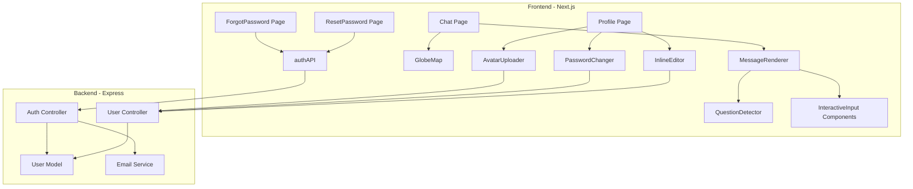

# Design Document: TravelAI Page Enhancements

## Overview

This design covers enhancements across multiple pages of the TravelAI Next.js application. The changes span both frontend (React/Next.js) and backend (Express/MongoDB), touching the AI chat experience, map behavior, profile page features, and the password reset flow. The existing orange theme, navbar, and all other working features remain unchanged.

Key changes:

- A new `QuestionDetector` module that parses AI responses and triggers interactive input widgets in the chat
- GlobeMap initialization from user IP geolocation with city/country-aware zoom levels
- Profile page redesign: avatar upload, inline editing with bio/phone fields, password change section
- Full forgot-password / reset-password flow wired to real backend endpoints
- Verification that the existing auth hydration flicker fix is in place

## Architecture

The feature set follows the existing layered architecture:



All new frontend components are client-side (`"use client"`) React components. Backend changes extend existing controllers and the User model. No new database collections are introduced.

## Components and Interfaces

### 1. QuestionDetector (`frontend/src/lib/questionDetector.js`)

A pure function module that inspects AI response text and returns a question type or `null`.

```js
/**
 * @param {string} text - AI response text
 * @returns {{ type: 'destination'|'duration'|'budget'|'preferences'|'companions', context: string } | null}
 */
export function detectQuestion(text) { ... }
```

Detection uses keyword pattern matching against predefined regex arrays for each question type. The function returns the first match found (priority: destination > duration > budget > preferences > companions). Returns `null` when no question pattern is detected.

Keyword patterns per type:

- **destination**: "where", "which city", "destination", "country", "place to visit"
- **duration**: "how long", "how many days", "duration", "nights", "length of trip"
- **budget**: "budget", "how much", "spend", "price range", "cost"
- **preferences**: "interests", "prefer", "enjoy", "activities", "what kind of"
- **companions**: "traveling with", "who", "solo", "group", "companion", "alone or with"

### 2. Enhanced MessageRenderer (`frontend/src/components/chat/GenerativeUI.jsx`)

Modify the existing `MessageRenderer` to:

1. Run `detectQuestion()` on each text block
2. If a question is detected, render the corresponding `InteractiveInput` component below the text
3. Use `react-markdown` (new dependency) to render text blocks instead of raw `<p>` tags
4. Strip residual markdown artifacts that react-markdown doesn't handle

The existing `<component>` tag parsing remains unchanged — question detection only applies to text blocks.

### 3. InteractiveInput Components (`frontend/src/components/chat/inputs/`)

Five new components, each receiving `onSend` callback:

| Component           | File                    | Behavior                                                                                                                                            |
| ------------------- | ----------------------- | --------------------------------------------------------------------------------------------------------------------------------------------------- |
| `DestinationSearch` | `DestinationSearch.jsx` | Text input with Mapbox geocoding autocomplete. On selection, sends `"I want to go to {city}"`                                                       |
| `DurationSelector`  | `DurationSelector.jsx`  | Button grid (1-30 days). On click, sends `"I'd like to travel for {n} days"`                                                                        |
| `BudgetSelector`    | `BudgetSelector.jsx`    | Three buttons: Budget, Mid-range, Luxury. On click, sends `"My budget preference is {level}"`                                                       |
| `PreferenceChips`   | `PreferenceChips.jsx`   | Multi-select chips (Halal Food, Beach, History, Shopping, Nature, Culture, Family, Adventure). On confirm, sends `"I'm interested in {selections}"` |
| `CompanionSelector` | `CompanionSelector.jsx` | Four buttons: Solo, Couple, Family, Friends. On click, sends `"I'll be traveling {choice}"`                                                         |

Each component auto-composes an answer string from the user's selection and calls `onSend(composedMessage)`.

### 4. GlobeMap Enhancements (`frontend/src/components/map/GlobeMap.jsx`)

Changes to the existing component:

- Accept a new `userLocation` prop `{ lat, lng }` from the Chat page
- On initial load (no destination), center map on `userLocation` instead of hardcoded Istanbul `[28.97, 41.01]`
- If `userLocation` is null (geolocation failed), fall back to `[0, 20]` zoom 2
- Add zoom level logic based on destination type:
  - Determine type from Mapbox geocoding `place_type` field (already available in `extractDestinationFromText`)
  - City-level (`place`): zoom 11
  - Country-level (`country`): zoom 5
  - Default: zoom 8

The Chat page (`frontend/src/app/chat/page.jsx`) will use the existing `useLocation` hook to get user coordinates and pass them to GlobeMap.

Modify `extractDestinationFromText` to also return `placeType` from the Mapbox geocoding response.

### 5. AvatarUploader (`frontend/src/components/profile/AvatarUploader.jsx`)

New component rendered in the profile header area:

```jsx
<AvatarUploader
  currentAvatar={profile?.avatar}
  userName={profile?.name}
  onUpload={(base64) => {
    /* call API, update store */
  }}
/>
```

Behavior:

- Renders a clickable avatar area with a camera icon overlay on hover
- Hidden `<input type="file" accept="image/jpeg,image/png,image/webp" />`
- On file select: validate size <= 2MB, read as base64 via `FileReader`, show preview
- On confirm: call `POST /api/users/avatar` with `{ avatar: base64String }`
- On success: update Auth_Store via `updateUser({ avatar })`

### 6. PasswordChanger (`frontend/src/components/profile/PasswordChanger.jsx`)

New component rendered in the Settings tab:

```jsx
<PasswordChanger isOAuthUser={!profile?.password && profile?.googleId} />
```

- If `isOAuthUser` is true: render info message, hide form
- Otherwise: render form with currentPassword, newPassword, confirmPassword fields
- Client-side validation: newPassword >= 8 chars, newPassword === confirmPassword
- On submit: `PUT /api/users/change-password` with `{ currentPassword, newPassword }`
- Backend: verify current password via `user.comparePassword()`, then hash and save new password

### 7. Inline Editing on Profile Page (`frontend/src/app/profile/page.jsx`)

Modify the existing profile page:

- Add `editMode` state boolean
- When `editMode` is true, name/bio/phone render as `<input>` fields; Save and Cancel buttons appear
- Save: `PUT /api/users/profile` with `{ name, bio, phone }`, then `updateUser()` on Auth_Store
- Cancel: revert to `originalValues` snapshot taken when entering edit mode

### 8. Backend: Password Change Endpoint

New endpoint in `backend/controllers/userController.js`:

```
PUT /api/users/change-password
Body: { currentPassword: string, newPassword: string }
```

Logic:

1. Fetch user with `select('+password')`
2. `user.comparePassword(currentPassword)` — if false, return 401
3. Set `user.password = newPassword` (pre-save hook hashes it)
4. `user.save()`
5. Return success

Route added to `backend/routes/users.js`.

### 9. Backend: Forgot Password & Reset Password Endpoints

Two new endpoints in `backend/controllers/authController.js`:

**POST /api/auth/forgot-password**

```
Body: { email: string }
```

1. Find user by email
2. If not found, return `{ success: true, message: "If an account exists..." }` (prevent enumeration)
3. Generate random token via `crypto.randomBytes(32).toString('hex')`
4. Store `resetPasswordToken = crypto.createHash('sha256').update(token).digest('hex')` and `resetPasswordExpires = Date.now() + 3600000` on user
5. Send email with link: `{FRONTEND_URL}/reset-password?token={token}`
6. Return success response

**POST /api/auth/reset-password**

```
Body: { token: string, password: string }
```

1. Hash the incoming token: `crypto.createHash('sha256').update(token).digest('hex')`
2. Find user where `resetPasswordToken === hashedToken` AND `resetPasswordExpires > Date.now()`
3. If not found, return 400 "Reset token is invalid or has expired"
4. Set `user.password = password` (pre-save hook hashes)
5. Clear `resetPasswordToken` and `resetPasswordExpires`
6. `user.save()`
7. Return success

### 10. User Model Schema Changes (`backend/models/User.js`)

Add fields:

```js
bio: { type: String, maxlength: 200, default: '' },
phone: { type: String, default: '' },
resetPasswordToken: { type: String },
resetPasswordExpires: { type: Date },
googleId: { type: String },  // if not already present for OAuth detection
```

### 11. Frontend API Client Updates (`frontend/src/lib/api.js`)

Add to `authAPI`:

```js
forgotPassword: (email) => api.post('/api/auth/forgot-password', { email }),
resetPassword: (token, password) => api.post('/api/auth/reset-password', { token, password }),
```

Add to `usersAPI`:

```js
changePassword: (data) => api.put('/api/users/change-password', data),
```

### 12. ResetPassword Page (`frontend/src/app/reset-password/page.jsx`)

New Next.js page at `/reset-password`:

- Reads `token` from `searchParams`
- Form: newPassword, confirmPassword
- Client validation: >= 8 chars, passwords match
- Submit: `authAPI.resetPassword(token, password)`
- On success: show success message with link to login
- On error: show error message (token invalid/expired)

### 13. Auth Hydration Fix (Verification Only)

Already implemented:

- `Auth_Store` has `hasHydrated` flag with `onRehydrateStorage` callback
- `Navigation` renders `<div style={{ width: 36, height: 36 }} />` placeholder when `!hasHydrated`
- When `hasHydrated` becomes true, correct auth state renders

No code changes needed — this requirement is already satisfied. Design confirms the existing implementation is correct.

## Data Models

### User Model (updated fields)

```js
{
  // Existing fields unchanged...
  bio: { type: String, maxlength: 200, default: '' },
  phone: { type: String, default: '' },
  resetPasswordToken: { type: String },
  resetPasswordExpires: { type: Date },
  googleId: { type: String },
}
```

### QuestionDetector Output

```ts
type QuestionType =
  | "destination"
  | "duration"
  | "budget"
  | "preferences"
  | "companions";

interface DetectedQuestion {
  type: QuestionType;
  context: string; // the matched portion of text
}
// Returns DetectedQuestion | null
```

### ExtractDestination Output (enhanced)

```ts
interface Destination {
  name: string;
  lat: number;
  lng: number;
  placeType: "place" | "region" | "country"; // NEW — from Mapbox place_type
}
```

## Correctness Properties

_A property is a characteristic or behavior that should hold true across all valid executions of a system — essentially, a formal statement about what the system should do. Properties serve as the bridge between human-readable specifications and machine-verifiable correctness guarantees._

### Property 1: Question detection classification

_For any_ AI response string containing a question pattern of type T (where T is one of destination, duration, budget, preferences, companions), the `detectQuestion` function SHALL return an object with `type === T`.

**Validates: Requirements 1.1, 1.2, 1.3, 1.4, 1.5**

### Property 2: No false positive question detection

_For any_ AI response string that does not contain any question-related keywords or patterns, the `detectQuestion` function SHALL return `null`, and no InteractiveInput component should be triggered.

**Validates: Requirements 1.8**

### Property 3: Interactive input message composition

_For any_ valid user selection on an InteractiveInput component (any type, any selection value), the composed message string SHALL be non-empty and SHALL contain a representation of the user's selection.

**Validates: Requirements 1.6**

### Property 4: Avatar file size validation

_For any_ file selected in the AvatarUploader, if the file size exceeds 2 MB (2,097,152 bytes) the upload SHALL be rejected with an error message, and if the file size is at or below 2 MB the upload SHALL proceed.

**Validates: Requirements 3.5**

### Property 5: Password change form validation

_For any_ password change form submission, validation SHALL pass if and only if the new password is at least 8 characters long AND the new password equals the confirm password field.

**Validates: Requirements 4.2, 4.3**

### Property 6: Backend current password verification

_For any_ authenticated user with a stored password hash, a change-password request SHALL succeed only when the provided current password matches the stored hash, and SHALL return a 401 error otherwise.

**Validates: Requirements 4.5, 4.6**

### Property 7: Edit cancel reverts state

_For any_ set of edits made to the profile fields (name, bio, phone) while in edit mode, clicking Cancel SHALL restore all fields to their values at the moment edit mode was entered.

**Validates: Requirements 5.4**

### Property 8: Forgot-password token security

_For any_ forgot-password request for a registered user, the system SHALL store a hashed version of the reset token (not the plain token) on the User model, and SHALL set an expiry approximately 1 hour in the future.

**Validates: Requirements 6.2**

### Property 9: Forgot-password response uniformity

_For any_ email address submitted to the forgot-password endpoint, the HTTP response status and body structure SHALL be identical regardless of whether the email is registered or not.

**Validates: Requirements 6.3**

### Property 10: Reset-password token validation and update

_For any_ reset-password request with a valid non-expired token, the system SHALL update the user's password hash and clear the resetPasswordToken and resetPasswordExpires fields. For any request with an invalid or expired token, the system SHALL return a 400 error.

**Validates: Requirements 6.6, 6.7**

## Error Handling

### Frontend Errors

| Scenario                                    | Handling                                                  |
| ------------------------------------------- | --------------------------------------------------------- |
| QuestionDetector fails to parse             | Falls through to plain text rendering — no crash          |
| Mapbox geocoding fails in DestinationSearch | Show "No results found" message, allow manual text input  |
| IP geolocation fails                        | GlobeMap falls back to world view [0, 20] zoom 2          |
| Avatar file > 2MB                           | Show inline error "Image must be under 2 MB", reject file |
| Avatar upload API fails                     | Show toast/inline error "Upload failed, please try again" |
| Password change validation fails            | Show inline field-level error messages                    |
| Password change API returns 401             | Show "Current password is incorrect"                      |
| Reset token invalid/expired                 | Show error message with link to request new reset         |
| Network errors on any API call              | Show generic error message, don't crash the page          |

### Backend Errors

| Scenario                                 | Handling                                                                  |
| ---------------------------------------- | ------------------------------------------------------------------------- |
| Forgot-password for unregistered email   | Return 200 success (prevent enumeration)                                  |
| Invalid/expired reset token              | Return 400 with descriptive message                                       |
| Wrong current password on change         | Return 401 with "Current password is incorrect"                           |
| OAuth user attempts password change      | Frontend prevents this; backend can also check for missing password field |
| Validation errors (short password, etc.) | Return 400 with validation error details                                  |

All backend errors pass through the existing `errorHandler` middleware.

## Testing Strategy

### Property-Based Tests

Use `fast-check` as the property-based testing library (JavaScript). Each property test runs a minimum of 100 iterations.

Tests to implement:

1. **QuestionDetector classification** — Generate random strings with injected question patterns, verify correct type detection. Tag: `Feature: travelai-page-enhancements, Property 1: Question detection classification`
2. **No false positive detection** — Generate random non-question strings, verify null return. Tag: `Feature: travelai-page-enhancements, Property 2: No false positive question detection`
3. **Message composition** — Generate random selections per component type, verify non-empty output containing selection. Tag: `Feature: travelai-page-enhancements, Property 3: Interactive input message composition`
4. **File size validation** — Generate random file sizes, verify 2MB threshold. Tag: `Feature: travelai-page-enhancements, Property 4: Avatar file size validation`
5. **Password validation** — Generate random password/confirm pairs, verify validation logic. Tag: `Feature: travelai-page-enhancements, Property 5: Password change form validation`
6. **Current password verification** — Generate random password pairs, verify bcrypt comparison. Tag: `Feature: travelai-page-enhancements, Property 6: Backend current password verification`
7. **Edit cancel revert** — Generate random edit values, verify cancel restores originals. Tag: `Feature: travelai-page-enhancements, Property 7: Edit cancel reverts state`
8. **Token hashing** — Generate random tokens, verify stored value is SHA-256 hash with correct expiry. Tag: `Feature: travelai-page-enhancements, Property 8: Forgot-password token security`
9. **Response uniformity** — Generate random emails, verify identical response shape. Tag: `Feature: travelai-page-enhancements, Property 9: Forgot-password response uniformity`
10. **Reset token validation** — Generate random tokens with varying expiry, verify correct accept/reject. Tag: `Feature: travelai-page-enhancements, Property 10: Reset-password token validation and update`

### Unit Tests (Example-Based)

- MessageRenderer renders react-markdown output for plain text responses
- DestinationSearch autocomplete calls Mapbox geocoding API
- GlobeMap zoom levels: city → 11, country → 5, fallback → 2
- AvatarUploader file picker accepts only JPEG/PNG/WebP
- PasswordChanger hides form for OAuth users
- ResetPassword page reads token from URL query params
- Auth hydration: placeholder renders when `hasHydrated` is false

### Integration Tests

- Full forgot-password → reset-password flow with real API calls
- Avatar upload end-to-end: file select → base64 → API → store update
- Password change end-to-end: form submit → API → success message
- Profile inline edit → save → API → store sync
- GlobeMap receives user location from useLocation hook on Chat page load
